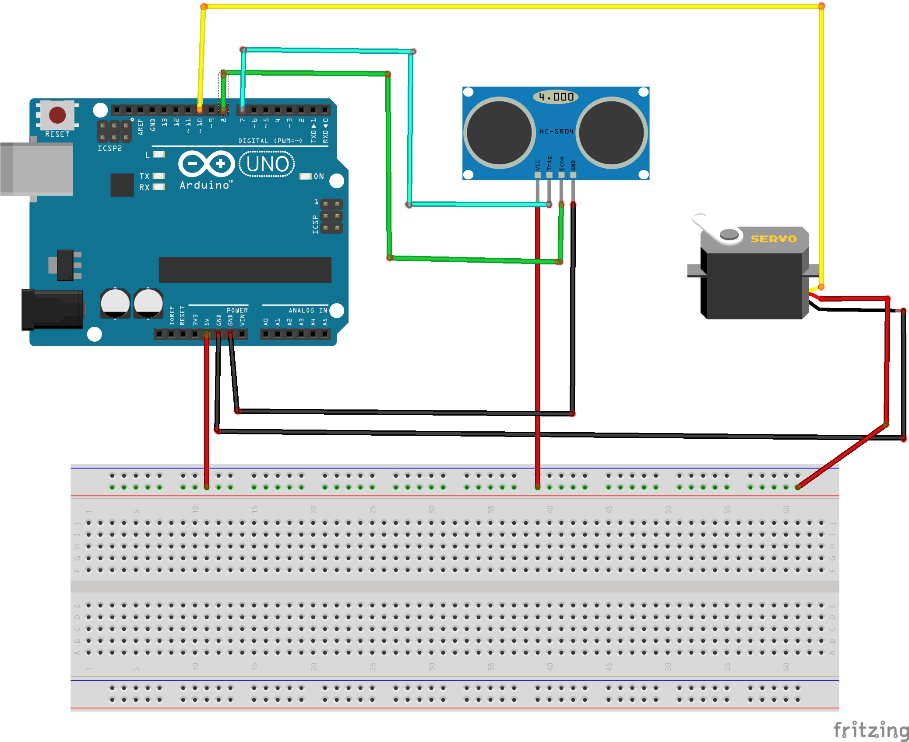
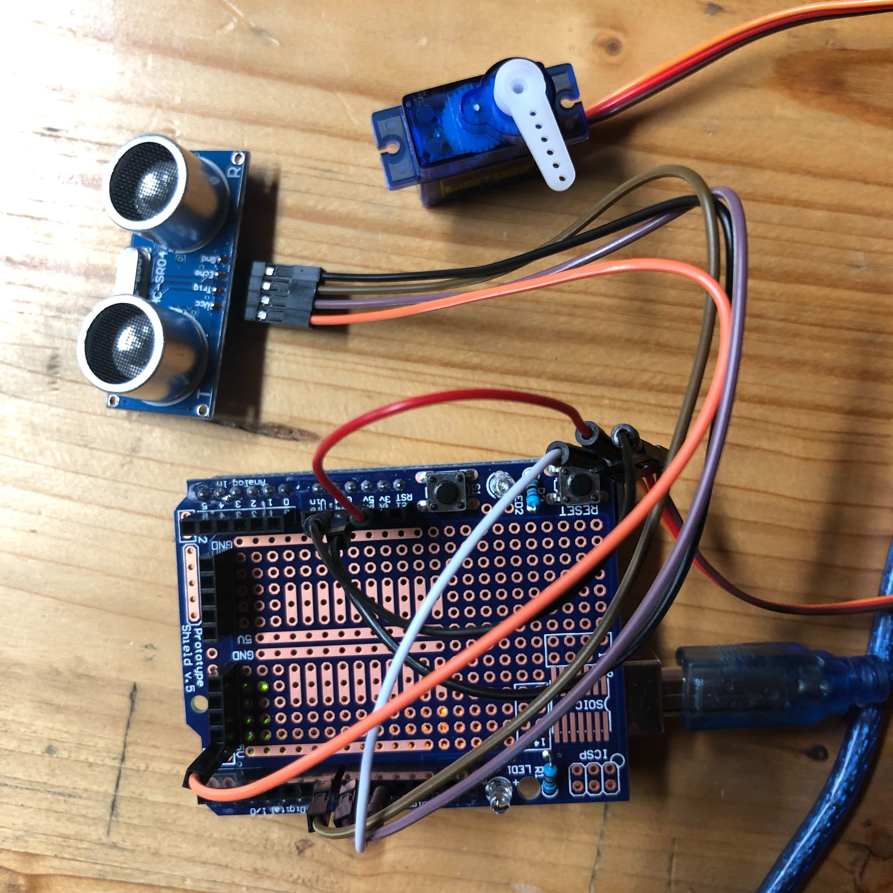

# automatictrash

Poubelle ouverture automatique

Ce projet à été réalisé par [@siham](https://github.com/siham87) et [@wildcat](https://github.com/wildcat7534)

## Video :
[](https://www.youtube.com/watch?v=WuTwOEJFxqc)


## **Bibliothéque utilisée**
+ #include <Servo.h>
+ #include <HCSR04.h>

## **Matériel**
+ Arduino
+ Servo-moteur
+ Capteur de proximité (HC-SR04)

## **Montage**



## **Code**

```
#include <Servo.h>
#include <HCSR04.h>
UltraSonicDistanceSensor distanceSensor(8, 7);
Servo servoMotor;

void setup() {
  
  Serial.begin(9600);
  servoMotor.attach(10);
}

void loop() {
  
  double distance = distanceSensor.measureDistanceCm();

  Serial.println(distance);
  
  if(distance < 30  && distance > 0){
    servoMotor.write(80); 
    delay(5000);
  }else{
    
 servoMotor.write(10);
  
  }
  

}
```


